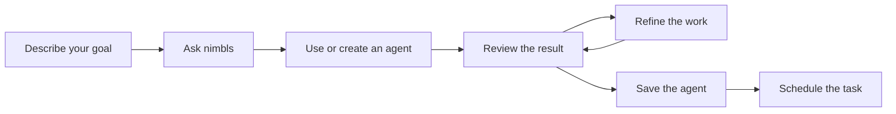

# Ask nimbls

**Start with a request. Get work done.**

English feature card · Review draft 01 · 2026-09-21

Status: Planned product experience, not an available-feature announcement. Ask nimbls and nimbls are provisional names. The desktop entry exists; the complete workflows below have not been validated end to end.

## Product introduction

Ask nimbls is your main assistant for getting work done with nimbls. Describe your goal in everyday language. It helps you use the available tools, create and manage agents, and turn useful work into a repeatable routine.

Start with an included agent or describe a new task. Review the result, explain what you want changed, and save the working approach for next time. For recurring work, ask nimbls to help set up a schedule.

## Why it matters

- **One place to start.** You do not need to know which feature or agent to use before asking for help.
- **From request to result.** Move from a description of the work to an inspectable deliverable.
- **Your way of working.** Refine instructions and results through conversation.
- **Useful work you can repeat.** Save an agent and schedule a proven task instead of describing it again every day.

## What you can ask

These examples describe intended capabilities; delivery scope is separated below.

| Your request | Intended outcome |
| --- | --- |
| “Summarize yesterday’s network events for this site.” | A readable summary with supporting syslog evidence and explicit information gaps. |
| “Create an agent that prepares this report every morning.” | An agent with a defined task, output, and schedule. |
| “Group repeated events and put the most important findings first.” | A revised report and a saved working approach for later runs. |
| “Help me configure nimbls and check what is missing.” | Guided setup using supported configuration and readiness checks. |
| “Review this agent’s recent work and suggest improvements.” | Evidence-based review and proposed changes, followed by comparison on representative cases. |
| “Archive older reports and keep important incidents easy to find.” | Reports organized according to defined archive and retention rules. |

## Customer scenario: From a daily chore to a reusable agent

**Customer:** A network operator who reviews site events each morning.

**Starting point:** The operator repeatedly gathers logs, identifies important events, and prepares a summary for colleagues.

**Request:** “Help me review yesterday’s syslogs for this site. Highlight important events and include the records behind your findings.”

**Planned experience:** Ask nimbls helps the operator use the included Daily Syslog Summary Agent, clarifies the necessary site and time scope, and initiates the work. The operator reviews the report, asks for repeated events to be grouped, and saves the refined agent. Once the result is satisfactory, the operator requests a daily schedule.

**Deliverable:** A daily report with the reviewed scope, key findings, source references, and missing information. Scheduled execution has its own visible outcome; an older report must not hide a failed run.

**Prerequisites:** A configured model, a working NIMBL connection, accessible syslog data, and a running application when scheduled work is due.

## 30-second sales explanation

“Ask nimbls is the main entry to your AI workspace. Tell it what you want to achieve—for example, a daily network summary. It helps you start with a ready-to-use agent, review the result, and adjust the way the work is done. Once you are happy with it, save the agent and schedule the task. The goal is simple: make useful work easier to start, improve, and repeat.”

## Three-minute demonstration outline

This is a planned demo script, not evidence of a working demonstration. Use a validated environment for a live demo; label any mockup as illustrative.

| Time | Demonstration | Point to communicate |
| --- | --- | --- |
| 0:00–0:30 | Open Ask nimbls and request yesterday’s site summary. | Start with a goal in everyday language. |
| 0:30–1:20 | Use the included agent and inspect its report and source references. | Ready-to-use agents provide a starting point; results have evidence. |
| 1:20–2:10 | Ask to group repeated events and prioritize important findings; inspect the revision. | Shape the work through feedback. |
| 2:10–3:00 | Save the refined agent and configure a daily schedule; show the next due time. | Turn an accepted result into repeatable work. |

Actual execution time depends on the environment. Use clearly identified pre-run results when necessary; the script is not a performance claim.

## Visual direction

**Icon concept:** A speech bubble with a small action arrow, communicating conversation that initiates work. Use a simple, consistent icon style across the capability set; this is an art direction, not a finished icon.

**Feature illustration:** Reconstruct the current desktop foundation using the canonical UI guide and application source: four tabs (Chat, Agents, Output, Configuration), Ask nimbls target header, welcome copy, four startup guidance cards, and composer. Preserve the disconnected notice and disabled Send state while live execution is unavailable. Do not place an invented report card inside Chat or imply a working schedule confirmation. Label it a design-aligned reconstruction, not a captured screenshot. Report examples elsewhere are document-content samples, not application UI.

**Illustration caption:** “Describe the goal. Shape the result. Repeat what works.”

## Delivery and sales guidance

| Scope | Positioning |
| --- | --- |
| POC 1 / M1–M3 | Introduce Ask nimbls through the default syslog agent and the create, try, refine, save, and schedule journey. Essential setup supports that journey. |
| Later POCs | Extend the same entry to site history, local-model workflows, report organization, agent improvement, controlled external assistance, and verified device changes as those capabilities are delivered. |
| Long-term product principle | All supported nimbls application operations should be accessible through agent-facing operations, so Ask nimbls can help users operate the product. This does not promise support for every conceivable task. |

Use “main assistant,” “ready-to-use agents,” and “repeatable work” consistently. Describe demonstrated scope explicitly. Do not claim autonomous self-improvement, guaranteed accuracy, or completed tasks without checking the actual result.

Related: [POC milestones and future features](../../MILESTONES.md) · [POC specification](../specs/macos-syslog-poc.md). The agreed seven-POC sequence is recorded in the roadmap; this card does not assign new delivery dates.
