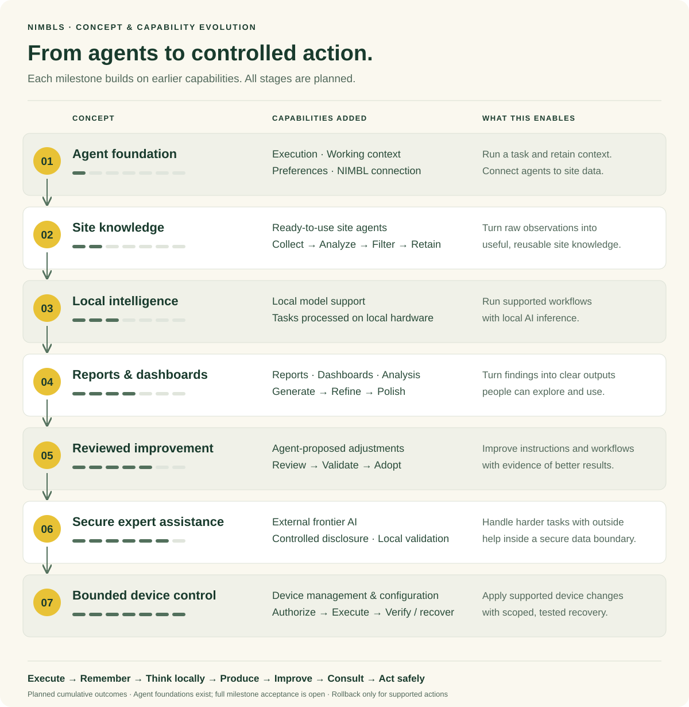

# nimbls — Product delivery roadmap

Planning scenarios: **10 or 15 working days per Milestone; 70 or 105 working days total**, sequential delivery. Week 1 begins at the agreed kickoff; calendar dates are not yet set. The presets model implementation and validation effort with continuous capacity and ready test inputs. They are not validated estimates, equal-complexity claims, or release commitments. Milestone 1 includes Features 1–3.

| Milestone | Duration | 2-week schedule | 3-week schedule | Delivery scope |
| --- | --- | --- | --- | --- |
| 1 | 2–3 weeks | Weeks 1–2 | Weeks 1–3 | Agent creation and daily syslog automation |
| 2 | 2–3 weeks | Weeks 3–4 | Weeks 4–6 | Site history retention and incident investigation |
| 3 | 2–3 weeks | Weeks 5–6 | Weeks 7–9 | Local model integration and general tasks |
| 4 | 2–3 weeks | Weeks 7–8 | Weeks 10–12 | Reports, dashboards and refinement |
| 5 | 2–3 weeks | Weeks 9–10 | Weeks 13–15 | Reviewed Agent improvement |
| 6 | 2–3 weeks | Weeks 11–12 | Weeks 16–18 | Controlled external model assistance |
| 7 | 2–3 weeks | Weeks 13–14 | Weeks 19–21 | Authorized device changes and verification |

## Capability evolution

Each stage adds to earlier capabilities: execute and remember → retain site knowledge → think locally → produce polished results → review and improve → consult external AI securely → act within device safety boundaries. All stages are planned.

## Milestone 1 — Agent creation and daily syslog automation

**Planned deliverable:** Build the core Agent architecture: task execution, working files, explicit preferences, retained execution records, and a shared NIMBL connection. This foundation is distinct from collected site knowledge.

**Duration scenario:** 10 or 15 working days; not a validated estimate.

- Feature 1: produce a manual syslog report with source evidence.
- Feature 2: refine, save and reuse the agent after restart.
- Feature 3: schedule daily execution and inspect actual outcomes.

**Default agent / entry:** Daily Syslog Summary Agent.

**Demo:** Create, run, refine, save, and schedule a syslog report.

**Acceptance:** With live NIMBL syslogs, create, run, refine and save an Agent; run the scheduled report and inspect real outcomes. Agent foundation checks alone do not complete this milestone.

**Feature pages:** [Ask nimbls](../ask-nimbls.html), [Custom Agents](../custom-agents.html), [Scheduling](../automation.html).

## Milestone 2 — Site history retention and incident investigation

**Planned deliverable:** Deliver ready-to-use agents for site data: collect, analyze, filter, and retain the information needed for future investigation.

**Duration scenario:** 10 or 15 working days; not a validated estimate.

- Define what observations and events are retained.
- Retrieve earlier incidents with source and time references.
- Compare current conditions with previous findings.

**Default agent / entry:** syslog-reviewer + device-snapshot + incident-investigator + ask-nimbls (extended).

**Demo:** Find a similar incident and compare changes and prior handling.

**Acceptance:** Collect scoped syslog findings and device snapshots, filter what matters, and retrieve a sourced incident timeline with explicit gaps. Requires a working collection and retention path.

**Feature pages:** [Site History & Knowledge](../site-history.html).

## Milestone 3 — Local model integration and general tasks

**Planned deliverable:** Support local AI models so agents can process data and complete supported tasks on local hardware.

**Duration scenario:** 10 or 15 working days; not a validated estimate.

- Configure and verify a supported local model.
- Run the network-reporting workflow locally.
- Validate document comparison without a NIMBL connection.

**Default agent / entry:** Locally validated network agents + Document Comparison Agent.

**Demo:** Run a network report and compare documents without external inference.

**Acceptance:** Complete representative supported tasks on documented local hardware/models and verify no external inference request. Requires compatible models and tools.

**Feature pages:** [Local AI](../local-ai.html).

## Milestone 4 — Reports, dashboards and refinement

**Planned deliverable:** Generate and refine reports, dashboards, and analytical findings into clear, useful deliverables.

**Duration scenario:** 10 or 15 working days; not a validated estimate.

- Generate an evidence-backed report or dashboard for a defined audience.
- Refine the findings, narrative and interactive view; inspect HTML in an isolated preview.
- Search, organize and archive outputs while verifying later retrieval.

**Default agent / entry:** Report creation, refinement and organization through Ask nimbls.

**Demo:** Generate and refine a report or dashboard, then retrieve an archived result.

**Acceptance:** Generate a sourced report or dashboard, revise it for an audience, inspect its isolated interactive view, and retrieve an archived result. Basic text saving is already part of the foundation.

**Feature pages:** [Results Center](../results-center.html).

## Milestone 5 — Reviewed Agent improvement

**Planned deliverable:** Enable agents to propose adjustments to their own instructions and workflows, with review and validation before adoption.

**Duration scenario:** 10 or 15 working days; not a validated estimate.

- Inspect retained agent inputs, instructions and outputs.
- Propose a targeted instruction or workflow change.
- Compare the revised result against missed and known-good cases.

**Default agent / entry:** Improvement review through Ask nimbls.

**Demo:** Review a missed event, propose a change, and compare revised results.

**Acceptance:** Agent proposes an instruction or workflow revision; a user reviews it; comparison on missed and known-good cases supports a decision before adoption. Existing optional evaluations are only a foundation.

**Feature pages:** [Agent Improvement Review](../agent-improvement.html).

## Milestone 6 — Controlled external model assistance

**Planned deliverable:** Securely connect to external frontier AI for harder tasks, sharing only permitted information and validating the results locally.

**Duration scenario:** 10 or 15 working days; not a validated estimate.

- Define reviewed data types, recipients and disclosure rules.
- Apply required approvals, routing and cost controls.
- Validate external analysis locally; demonstrate blocked requests.

**Default agent / entry:** Controlled consultation for existing agents.

**Demo:** Ask an approved model for help using only policy-permitted evidence.

**Acceptance:** Enforce reviewed rules for outbound data and approved recipients, demonstrate blocked disallowed requests, and validate returned advice locally. Direct provider access does not satisfy this boundary.

**Feature pages:** [Controlled External Assistance](../external-assistance.html).

## Milestone 7 — Authorized device changes and verification

**Planned deliverable:** Enable Agents to manage and configure devices within defined safety boundaries, with result verification and rollback for explicitly supported operations.

**Duration scenario:** 10 or 15 working days; not a validated estimate.

- Define one supported change and its authorized device scope.
- Capture the starting state and execute authorized operations.
- Verify actual results and report partial failures and recovery needs.

**Default agent / entry:** Device Change Agent.

**Demo:** Execute a supported authorized change and verify actual device state.

**Acceptance:** For a defined supported operation, authorize the device scope, capture starting state, apply and verify the change, and demonstrate its tested rollback. Unsupported recovery must be stated before execution.

**Feature pages:** [Execution Management](../execution-management.html).

## Planning assumptions

- Milestone 1 is 2–3 weeks for Features 1–3 combined, not per milestone.
- Start the next Milestone after acceptance. Shorter stages advance subsequent work.
- Estimates assume continuous capacity, ready models/devices/data, and no additional scope. Delays may extend the range.
- Default agents start in Milestone 1. Basic outputs and execution controls are included there.
- No calendar kickoff date, release commitment, or universal production readiness is implied.

## Taiwan working-day schedule

Use the interactive Roadmap page to choose a kickoff and 10 or 15 working days per Milestone. It excludes official non-working dates from the bundled 2026–2027 DGPA office calendars and provides dated SVG/Markdown downloads with excluded dates. The undated poster shows effort only; holidays extend calendar duration. Company leave and emergency closures are not included. Source: https://data.gov.tw/dataset/14718.

## Milestone 2 agent delivery

See [Milestone 2 agent features](poc2-agent-milestones.md) for the four planned agent features and acceptance criteria.
