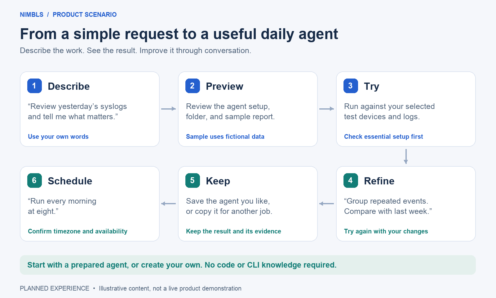
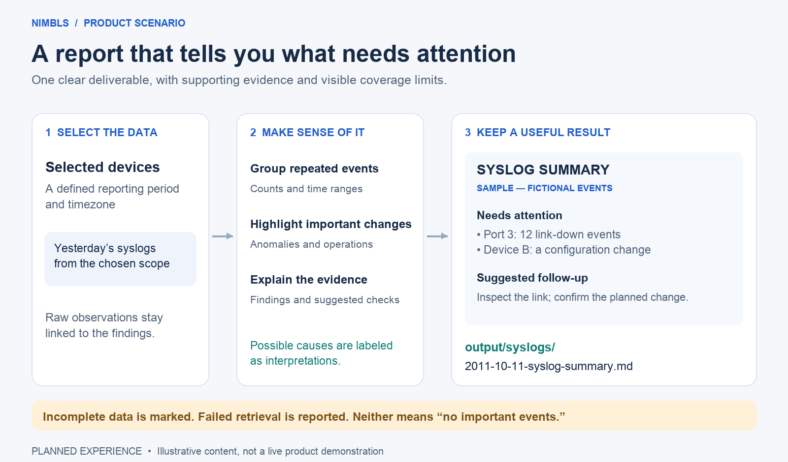

# Scenario: create a daily syslog agent

Status: Proposed walkthrough for users, sales, and marketing. All events and names below are fictional. This is not a completed product demo or a promise of a release date.

This walkthrough is the initial reporting step of the [Event follow-up agent](../guides/starter-agents.md). The broader proposed workflow retains unresolved problems and verifies whether they recur after action; producing this report alone does not complete that workflow.

## The operator’s need

A network operator wants a useful daily summary instead of repeatedly reviewing raw syslogs. They need important findings, supporting evidence, and a file they can refer to later.

## A short explanation for customers

The planned experience is simple: describe the report you need, review a sample, and try the agent on your selected logs. Refine the result through conversation, then reuse the agent or schedule it. Each report should show what needs attention, the supporting evidence, and any missing data.

The two illustrations below can also be reused in a presentation. They show a proposed experience and fictional report content, not released functionality or measured customer results.

## The experience at a glance

Proposed user journey. The sample is illustrative; the trial uses actual data from the selected test environment.



## 1. Describe the agent

> Create an agent that checks yesterday’s syslogs, extracts important events and anomalies, and tells me what needs attention. Run every morning at 08:00 and save a Markdown file named {date}-syslog-summary.md. Show me a sample report first.

The creation-agent proposes an analysis setup and asks for missing essentials: the NIMBL connection, device scope, and timezone. It explains that “yesterday” is the previous calendar day in that timezone. If the operator instead asks for “today,” the proposal must clarify whether that means today so far or a completed day analyzed later.

## 2. Review the setup

| Item | Example proposal |
| --- | --- |
| Agent name | syslog-data-agent |
| Agent ID | syslog-data-agent-{generated-id} |
| Purpose | Preserve important syslog findings for later reference. |
| Model | Suggest an available compatible model from configured providers, with a short reason. No provider is fixed by this example. |
| Tools | Scoped syslog retrieval through nimbl-bbcli and write-output |
| Skills | A syslog-analysis procedure, if available; missing capabilities must be disclosed. |
| Access | Read selected device logs; write approved outputs. No device configuration changes. |
| Timing | Daily at 08:00, Asia/Taipei, analyzing the previous calendar day |
| Output | Markdown in the shared syslogs/ subfolder |
| Filename | {date}-syslog-summary.md, where date is the analyzed day |

The assistant explains any missing setup. It does not require generic database or script access simply because those tools exist. Tool names here are proposed product capabilities; actual commands and runtime integration still need verification.

## 3. Preview and discuss the output

Illustrative destination: output/syslogs/2011-10-11-syslog-summary.md, produced by a scheduled analysis on the following morning. The actual output root location is not yet defined.

```markdown
# Syslog summary — 2011-10-11

> SAMPLE — synthetic data; no actual logs were retrieved.

Period: 2011-10-11 00:00 to 2011-10-12 00:00, Asia/Taipei

## Summary
One repeated connection issue and one configuration change need review.

## Anomalies and alerts
- Example switch A, port 3: 12 link-down events between 09:12 and 09:31.
  Evidence: sample event references E001–E012.
  Possible explanation: an unstable link; the cause is not confirmed.
  Suggested action: inspect the link and connected device.

## Important operations
- Example switch B: configuration change recorded at 10:05.
  Evidence: sample event E013.
  Suggested action: compare with the expected maintenance activity.

## Coverage and limitations
This is an illustrative preview. A real report lists sources inspected,
retrieval gaps, and limits on its conclusions.
```

The operator can ask for fewer details, extra counts, a different folder, or another output format. The assistant revises the proposal before confirmation. Preview content is not copied as factual findings into real reports.

## 4. Confirm and prepare

After confirmation, nimbls prepares the agent and the selected output folder and checks whether the required provider and NIMBL connection are usable. It shows readiness or explains what is missing. The review must make clear whether the schedule will be enabled; saving the configuration is not evidence that an analysis has run.

## 5. Run once and inspect the result

The operator presses Run to execute the agent’s saved default task. Opening chat or repeating the task description is not required. The intended result is a real Markdown report with source coverage, grouped findings, and supporting observations. nimbls shows the outcome and the actual saved path, with attribution to the agent and execution.

If retrieval fails, the execution reports failure. If only some sources are available, the report identifies partial coverage. No important findings is a valid result only when the report makes clear what was inspected.

Repeated executions must preserve earlier evidence rather than silently overwrite another result; the detailed naming policy remains to be finalized.

### What happens during an execution

Manual and scheduled tasks follow the same path. A scheduled execution requires the chosen local environment to be available.



The report uses the analyzed date in its filename. Partial coverage stays visible in the result; successful retrieval with no important findings is different from failed retrieval. Saving the report must succeed before nimbls presents a saved-file result; a write error remains an execution error.

## 6. Refine, save, and schedule

The operator says “Compare with the previous seven days.” The creation-agent updates the setup and checks access to that history, then tries the revised task in the selected test environment. The resulting report must show an actual comparison or explain the missing evidence.

After inspecting the result, the operator can save the agent or say “Run it every morning at eight.” Show the selected timezone and enabled schedule. This trial-and-refinement experience is a Milestone priority; full production security administration is refined later. Secure external model assistance remains outside milestone 1.

## What a pilot should demonstrate

- A user can create the agent through a description and review, without code or CLI knowledge.
- The agreed connection, scope, reporting period, and output rules are actually used.
- Findings are supported by retrieved events; interpretations are distinguishable from observations.
- The result appears in the agreed shared output category and can be found later.
- Failed or partial retrieval is visible, and a retry preserves prior results.
- A scheduled case follows the selected timezone and makes local availability limits visible.

These are proposed acceptance points, not passed tests. Daily operation still requires the chosen local execution environment to be available; always-on shared-server execution is not part of the initial scope.

## For sales and marketing

The story to communicate is: “Describe the work, review the expected result, and keep a traceable daily report.” Evaluate usefulness and time spent reviewing logs in a pilot before making numerical savings claims. This scenario supports human follow-up; it does not demonstrate autonomous repair or guaranteed detection of every anomaly.

Related: [Copyable creation examples](../guides/create-an-agent.md) · [Agent concepts](../concepts/agents.md) · [Detailed function draft](../specs/fundamental-function-blocks.md)

## Milestone 2 extension

The initial reporting scenario remains Milestone 1. Milestone 2 adds script-first syslog classification and trend checks, daily device snapshots and on-demand incident investigation through Ask nimbls. See [default agents and delivery milestones](../guides/starter-agents.md) for responsibilities, pattern review, retention and acceptance. Daily work does not require a fresh chat request.

## GitHub feature tracking

- [syslog-reviewer](https://github.com/bbtechhive/nimbls-public/issues/35)
- [device-snapshot](https://github.com/bbtechhive/nimbls-public/issues/36)
- [incident-investigator](https://github.com/bbtechhive/nimbls-public/issues/37)
- [ask-nimbls site operations](https://github.com/bbtechhive/nimbls-public/issues/38)
