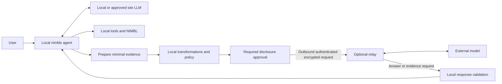

# Secure external assistance: design and frontend contract

- Status: Design draft. Confirmed requirements and proposed mechanisms are distinguished below.
- Updated: 2026-09-18
- Scope: Future secure external assistance; explicitly excluded from milestone 1. Local LLM support remains in the initial product direction.
- Audience: Frontend agents/developers, runtime and security engineers, product owners, and report authors.
- Implementation evidence: None. No relay, sanitization, async exchange, frontend flow, or security test described here has been implemented or verified.
- Related issue/milestone: None created. This document does not commit a delivery date.
- Related: [Function blocks](fundamental-function-blocks.md), [繁體中文報告摘要](../concepts/secure-assistance-overview.md).

## How to use this document

For frontend work, read scope, the architecture, the UI contract, and the state/error tables before drafting screens. For security work, use the per-data-type review and testing section as the release gate. For a presentation or stakeholder report, use the linked Chinese overview and retain its scope and limitations.

This is the canonical product design for this feature. Frontend state labels and example contracts below are proposals, not implemented API enums. During milestone 1, assess stack compatibility only; do not build or advertise a functioning external-assistance flow.

## Confirmed requirements and unresolved choices

| Confirmed requirement | Design proposal or unresolved choice |
| --- | --- |
| Support local LLMs and controlled external model assistance. | Exact model runtime, provider, and hardware support |
| External assistance is outside milestone 1; consider it during tech-stack review. | Which later milestone includes it |
| Every outbound data type needs its own rules, complete review, and applicable tests before enablement. | Exact type schemas, reviewers, thresholds, and policy implementation |
| Easy use and readiness out of the box remain project rules. | Final screen layouts, wording, and deployment setup |
| Keep permissions and device-change approval enforceable outside model instructions. | Specific isolation and tool-enforcement mechanism |

The recommended topology is one local nimbls plus an optional lightweight relay. It is not an accepted requirement for two full nimbls installations or an autonomous external agent. The relay recommendation and direct-provider alternatives must be evaluated during stack review.

## Architecture and authority



| Responsibility | Local nimbls | Optional relay / external model |
| --- | --- | --- |
| Task ownership | Retains agent, task, execution, and local history | Processes a bounded analysis request |
| Site access | Enforces local tool and device permissions | Has no direct bbcli, filesystem, or device access |
| Disclosure | Prepares, transforms, and authorizes data before sending | Receives only the approved package; cannot grant itself more access |
| Provider access | Configures permitted recipient identity and route | Relay may hold provider credentials, enforce routing, and account for usage |
| Verification | Checks returned claims and any proposed local action | Returns advice and identified evidence gaps |
| Recordkeeping | Retains local evidence and approved results with attribution | Proposed minimal operational metadata; actual retention requires verification |

Local NIMBL credentials and alias mappings stay local. Provider credentials may reside at the relay in the proposed topology and must not appear in model prompts. Model output, logs, and requests for more evidence are untrusted input.

## Local models and secure external analysis

Scope: local LLM support remains in the initial product direction. The secure external-analysis workflow, relay, sanitization pipeline, and progressive evidence exchange are future work, explicitly excluded from the first milestone. The supplied architecture illustrates local processing with controlled external assistance. Pi, its extension mechanism, an AI Relay, Ollama/llama.cpp/vLLM, mTLS, and SSH tunneling are implementation candidates, not selected or verified integrations.

The initial local application should support a model running on the operator’s computer or an approved inference endpoint within the site. Local application deployment alone does not establish local inference. The creation-agent must also respect model/data-routing policy because its input may contain site information.

Proposed user-facing modes:

| Mode | Behavior |
| --- | --- |
| Local only (default) | Use approved local/site models; make no external inference request. If local analysis cannot complete the task, report the limitation instead of silently switching to cloud. |
| Local with external assistance (future; outside milestone 1) | The same nimbls-managed agent can request additional analysis through a controlled outbound boundary, only when policy permits. Recommend reviewing the destination and exact prepared payload before each external request initially. |

External assistance is a model/tool integration, not the deferred external-agent workspace feature. The original agent retains task state, local tool access, and responsibility for the result.

Proposed outbound workflow:

1. The local agent identifies a specific analysis question and explains why external help would be useful.
2. Build the smallest necessary evidence package. Do not send the full conversation, raw log archive, local workspace, or shared output folder by default.
3. Remove secrets and disallowed fields, and pseudonymize identifiers where useful. Keep any mapping local. Treat free text and source logs as untrusted; sanitization is not proof that sensitive information is absent.
4. Apply an enforceable policy outside model instructions: allowed destination/model, data categories, size/cost limits, and required user approval. Approval binds to the prepared payload and destination; changing either requires a fresh check. Denied or unavailable checks block transmission.
5. Send through an outbound-only, authenticated encrypted connection with server identity verification. Validate client identity where required. If a relay is used, it must enforce destination/access policy; its next hop to the model provider is also part of the protected path. Do not fall back to an insecure transport or different provider after failure.
6. Validate the returned structure and treat its contents as untrusted advice. Check claims against local evidence where possible and disclose what remains unverified. The response cannot grant itself file, command, or device permissions; any device change follows the existing local approval path.
7. Record actor/agent/execution, destination, time, policy outcome, payload fingerprint, and request outcome. Keep credentials, raw payloads, and response contents out of routine transport/audit logs. Local approved reports may retain useful findings under the existing output rules.

Proposed future UX, when external assistance is implemented: show **Local only** as the simple default. External assistance is an optional guided setup; a request preview shows why it is needed, where data would go, and what would be sent. Scheduled executions that require approval wait visibly; they do not auto-approve export. If external assistance is unavailable, report that limitation or continue locally only when that remains a valid way to meet the task.

Security statements must match demonstrated behavior. Encryption protects transport; it does not prevent an approved recipient from seeing submitted content. Relay logging, provider retention, and training/data-use settings must be verified separately for the selected deployment. Do not promise “no data leakage” or “no retention” from this diagram alone. An air-gapped site remains local-only unless its network policy explicitly permits an outbound path.

Readiness must distinguish missing local runtime/model resources from missing external access. Check model availability and required tool capabilities; local hardware sizing and model provisioning are still open. Offline inference requires models and other dependencies to be provisioned beforehand. No model download, cloud account, or relay deployment is implied by this design decision.

### Required review and testing for each outbound data type

Confirmed requirement: define separate security rules for every type of outbound data. Each type must complete a documented review and its full applicable test suite before it can be enabled. A generic sanitizer or one shared successful test does not establish safety for all data types. Unknown, unclassified, or unreviewed types are denied by default. This is a release gate for future external assistance, not work added to milestone 1.

Examples requiring distinct rules include structured syslog events, raw syslog text, device inventory, topology, configuration differences, configuration backups, report excerpts, and user-entered free text. Include derived summaries and combinations of these types; model-generated text is not automatically safe to disclose.

For each data type, record:

- Its source, schema/version, business purpose, permitted recipients, and allowed scope/volume.
- Allowed and prohibited fields, sensitivity classification, and rules for unknown fields or malformed input.
- Required removal, aliasing, aggregation, or precision reduction, including how useful analytical relationships are preserved.
- Approval requirements, cumulative disclosure limits, and handling of attachments, free text, nested content, metadata, and errors.
- A named reviewer, review outcome, policy/transformation version, test evidence, known limitations, and enabled/disabled status.

The review must assess the actual outbound representation, not only the original source schema. Test the full applicable path from source through parsing, transformations, policy, approval, serialization, and transport. Include at least:

| Test area | Required evidence |
| --- | --- |
| Permitted data | Representative approved data preserves the intended analysis value and emits only allowed content. |
| Prohibited data | Seeded credentials, identifiers, and disallowed content are removed or transmission is blocked, including nested and free-text placements. |
| Unexpected input | Unknown fields, schema changes, encoding variations, malformed/oversized content, and transformation failures cannot silently pass through. |
| Hostile content | Instructions embedded in logs or external requests cannot bypass policy, expand access, or cause arbitrary file/command disclosure. |
| Progressive disclosure | Individually permitted payloads are evaluated together for cumulative scope, identity linkage, and limits across rounds. |
| Approval and destination | Changes to payload, recipient, or applicable policy invalidate stale approval; blocked requests do not use an alternate route. |
| Operational failure | Retry, cancellation, restart, timeout, and transport errors do not send unapproved payloads or leak their content into logs, traces, or error reports. |

Use synthetic or appropriately sanitized fixtures with explicit expected allow/block results; include representative end-to-end capture of what would actually be transmitted. Record justified non-applicable cases rather than silently omitting them. Review limitations honestly; passing tests is not a claim of zero disclosure risk.

Re-review and rerun affected tests when a schema, parser, transformation, recipient, or policy changes. Freeze or disable affected export paths until the updated version passes the required checks. A release must identify exactly which reviewed data types and versions are enabled.

### Tech-stack review considerations for future assistance

Evaluate whether the chosen runtime can later support tool interception, policy-controlled model routing, structured requests/responses, durable async waiting and resumption, approval tied to a particular payload, and scoped local evidence access. Preserve these options through clear responsibilities; do not build a relay, generic plugin framework, or speculative external-agent system in milestone 1.

Retain the following discussion inputs for a future SPEC:

- The local agent proposes escalation with a specific question, available evidence, missing information, and a reason. Policy outside the model decides whether disclosure is permitted.
- External analysis may return an answer, a bounded request for additional evidence, or an inability to conclude. It cannot directly query local tools or choose arbitrary files/commands to execute.
- Persist request/execution IDs, round, payload version, approval, deadline, and outcome. Consider outbound polling, retry deduplication, restart recovery, cancellation, and late-response handling.
- Define evidence sufficiency per task and distinguish a useful next check from a verified root cause or authority to change a device.
- Use field/source/destination allowlists and local transformations, with local alias mappings and checks for residual sensitive data. Enforce cumulative disclosure, round, time, and cost limits across progressive requests.

The stack must allow versioned per-data-type policies and isolated plus end-to-end disclosure tests, with unreviewed types blocked. Exact mechanisms remain undecided. First-milestone acceptance must not depend on implementing these future functions.

## Proposed asynchronous consultation protocol

The model proposes a question; the local runtime decides whether to proceed. Do not use a self-reported confidence score as the sole escalation trigger. Useful reasons include conflicting hypotheses after available local checks, insufficient local reasoning capability, or a requested second opinion. Missing local observations should be retrieved locally when appropriate before seeking external analysis.

Each consultation needs a stable consultation ID, owning execution ID, round/request ID, evidence timestamps, immutable prepared payload version/fingerprint, policy version, approved destination/route/model, deadline, and outcome. These are design fields, not a final storage schema. A fingerprint identifies a payload but does not anonymize its contents.

The external response contract should allow:

| Response | Required meaning | Local handling |
| --- | --- | --- |
| analysis | Claims, evidence references, remaining uncertainty, and suggested checks | Validate structure/references and check applicable claims locally. |
| need_more_evidence | Specific evidence type, scoped target/time range, purpose, and the question it would resolve | Validate against a supported request catalog; gather only locally authorized data and repeat disclosure checks. |
| cannot_conclude | Explain the unresolved question and evidence limitations | Stop or ask for human input; do not fabricate a conclusion. |

Additional-evidence requests are not remote tool calls. Do not accept arbitrary paths, SQL, shell commands, or URLs as instructions to execute. An approved local query gathers the data; each new payload is independently checked and must respect cumulative disclosure limits.

Evidence sufficiency is task-specific. Enough evidence to recommend an inspection is not enough to establish root cause or authorize a configuration change. Validate source coverage, timestamps, required fields, and claim-to-evidence references. If required evidence is unavailable or cannot be disclosed, return a limited conclusion or inability to conclude.

Proposed transport behavior: local outbound submission and polling, with persisted state across restart. A disconnected UI does not cancel a request. A relay should deduplicate request IDs; an uncertain provider outcome must not cause blind resubmission or a promise of exactly-once provider execution. Record bounded retries and costs. Cancelled, expired, or superseded requests must not resume execution on late responses. Cancellation does not retract disclosed data. Recheck current policy and evidence freshness before resuming after a long wait.

## Frontend contract

### Placement and progressive disclosure

| Surface | Essential content | Details on demand |
| --- | --- | --- |
| Application / agent settings | Local-only mode; whether external assistance is allowed and configured | Recipient policy, limits, local/provider readiness, tested data-type coverage |
| Execution detail | Current state, why help is requested, waiting reason, next permitted action | Consultation timeline, request IDs, round, policy version |
| Disclosure review | Recipient, purpose, selected evidence scope, transformed payload, and decision actions | Full exact payload, transformations, removed fields, cumulative disclosures, size/cost estimate if available |
| Result | Findings, local verification outcome, gaps, output location, and external contribution | Evidence references, request history, stale or unsupported claims |
| Audit view | Who authorized which request, when, destination, and outcome | Policy/version and minimal metadata; no raw transport payload by default |

Do not put provider secrets in frontend storage or expose them in previews. Do not send previews to analytics, browser error reporting, or remote logging. Raw source comparison, if supported, is local and access-controlled. Avoid placing confidential values in paths, URLs, labels, or notifications.

### Approval behavior

The review UI is a view of a backend-prepared immutable package, not an independently reconstructed summary. Show the destination chain, including relay and final provider/model, so approval does not hide who receives data. Explain what was removed without reproducing removed secrets. Show cumulative scope across rounds, not only the latest addition.

The backend authorizes the send against the authenticated reviewer, exact payload/version, current policy, destination, route, and limits. Frontend button visibility is not enforcement. Repeated clicks must not create duplicate sends. Changes to content, recipient, or applicable policy invalidate approval and return the flow to review. Editing a proposal produces a new prepared version.

Proposed initial actions: **Approve this request**, **Decline external assistance**, and **Cancel task**. Decline does not mean cancel the task: the agent may continue locally if it can still meet the task’s criteria, otherwise it reports the limitation. Approval grants disclosure only; device changes need their own approval. Scheduled requests wait visibly for a person when required; they cannot approve themselves.

### Display states and allowed actions

These describe consultation state, separate from overall task/execution state. Persisted backend state is authoritative; do not infer success from a finished animation or HTTP submission response.

| State | Suggested user message | Available action / expected behavior |
| --- | --- | --- |
| Preparing evidence | Preparing information for external analysis | Cancel preparation; no external data has been sent. |
| Blocked by policy | This information cannot be sent under the current policy | Explain the blocked category without leaking its values; no approve-anyway bypass. |
| Awaiting approval | Review what would be shared | Approve this version, decline, or cancel task. |
| Sending | Sending the approved request | Show uncertainty accurately if transport fails; do not invite blind resubmission. |
| Waiting for external analysis | External analysis is in progress | Continue other work; allow cancellation request. Show deadline. |
| More evidence requested | Additional information is needed | Show what and why; gathering and a new disclosure review follow. No automatic export. |
| Verifying locally | Checking the returned analysis | Show that external analysis is not yet a verified result. |
| Completed | Analysis available | Show verified claims, unresolved limits, and output links. |
| Inconclusive | Available evidence is insufficient | Show gaps and a useful next step where possible. |
| Failed / timed out | External assistance could not complete | Explain retry eligibility; preserve local evidence and request outcome. |
| Cancel requested | Cancellation requested | Do not claim remote processing stopped until acknowledged; disclosed data is not recalled. |
| Cancelled / expired | This consultation will not resume the task | Retain attribution; late results do not trigger tools or task continuation. |

On restart or reconnect, reload the persisted status and prepared version. A stale approval dialog must be rejected by the backend. If current observations differ from the evidence analyzed, show staleness and require appropriate local revalidation.

### Safe rendering

Render evidence and model output as untrusted content. Escape active markup, do not auto-run commands or auto-fetch embedded remote resources, and apply output-file access controls to links. A model-generated button, instruction, or claim of approval must not become an application action. Error messages should provide a nonsecret request reference rather than raw provider payloads.

## Concrete syslog walkthrough for frontend work

All values below are synthetic. This illustrates the future flow, not an implemented demo.

1. The local agent observes 12 link-down events for device-A/port-3 and cannot distinguish a link problem from a restart. It proposes a specific external question after available local checks.
2. The user sees the destination and prepared evidence: event code, count, observation interval, and stable local aliases. Original hostnames and IP addresses are not included. The relevant data type must already have passed its security review and tests.
3. After approval, the consultation shows “Waiting for external analysis.” The user can leave the screen; the execution persists its waiting state.
4. The external model requests a five-minute window of interface counters to discriminate between the hypotheses. nimbls validates the requested type/scope and obtains authorized observations locally.
5. If counter data is unreviewed for export, the request is blocked. Otherwise nimbls prepares a new package, checks cumulative disclosure, and shows a new review. Prior approval does not cover new data automatically.
6. The external analysis suggests inspecting the physical link and cites event IDs. nimbls checks those references and saves a qualified finding. It does not claim that the root cause has been proven or execute a configuration change.

## Review record template for each data type

This is a design template, not an enabled policy. A security review must fill the details before use.

```yaml
data_type: <specific type>
schema_version: <version>
policy_version: <version>
status: disabled
owner: <responsible owner>
reviewer: <reviewer>
purpose: <permitted analysis>
allowed_sources: []
allowed_recipients: []
allowed_fields: []
prohibited_fields: []
transformations: []
unknown_input: block
approval_rule: <rule>
cumulative_limits: <limits>
test_evidence: []
review_outcome: pending
known_limitations: []
```

Do not treat this example as the final executable schema. Review the actual serialized request, including instructions and derived summaries, rather than approving only the data subsection.

## Future acceptance and validation

Before enabling this feature, validate the per-type release gate above plus these frontend/backend cases:

- Local-only mode makes no external inference request, including from creation assistance and output-preview generation.
- A manipulated client cannot send blocked types or bypass approval by calling the backend directly.
- The displayed prepared version is exactly the version authorized for sending; stale reviews, double clicks, and concurrent edits are handled safely.
- A second evidence round requires current policy checks and applicable approval and respects accumulated limits.
- Restart/reconnect restores waiting state without duplicate disclosure; timeout/cancellation does not cause automatic fallback or continuation.
- Transport, relay, provider, and UI diagnostics do not expose seeded secrets in captured test logs; real observations are not used as public test fixtures.
- External content cannot invoke tools, load remote tracking resources, or expand access through rendered UI.
- Results distinguish an external suggestion, a locally checked observation, and an unverified conclusion.

Report which cases passed, with the tested policy/schema versions and limitations. No checks listed here have run against an application yet.

## Open decisions for later design

- Local runtime, supported models/hardware, and provisioning experience.
- Relay ownership, hosting, direct-provider support, credential lifecycle, and verified retention behavior at every recipient.
- First supported outbound data types and their reviewers; production policy administration and authorized approvers.
- Protocol/schema, polling frequency, deadlines, round/cost/disclosure limits, and evidence freshness rules.
- Exact sanitization techniques per type, local alias lifetime, record retention/deletion, and cumulative linkage checks.
- Detailed task-specific evidence requirements and local verification capabilities.

None of these selects Pi or commits to a new external-agent application. During the first milestone, only the relevant future compatibility should inform stack choices.
